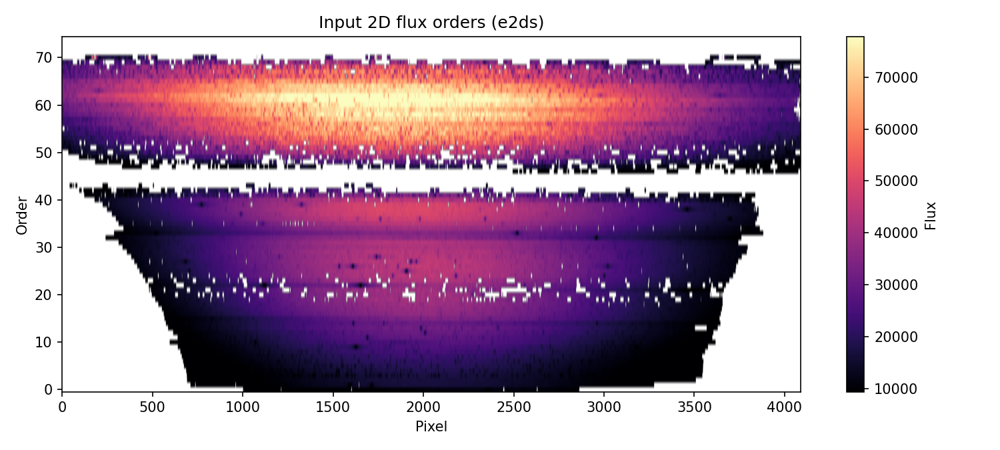
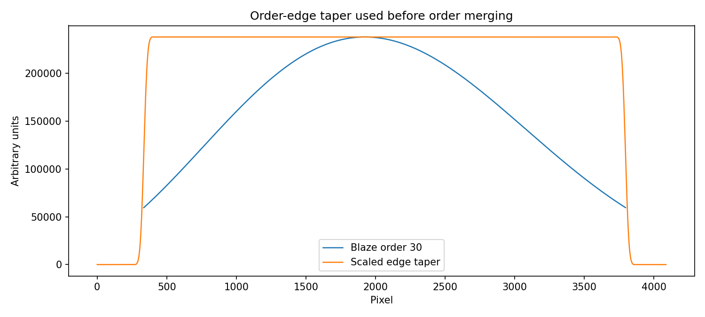
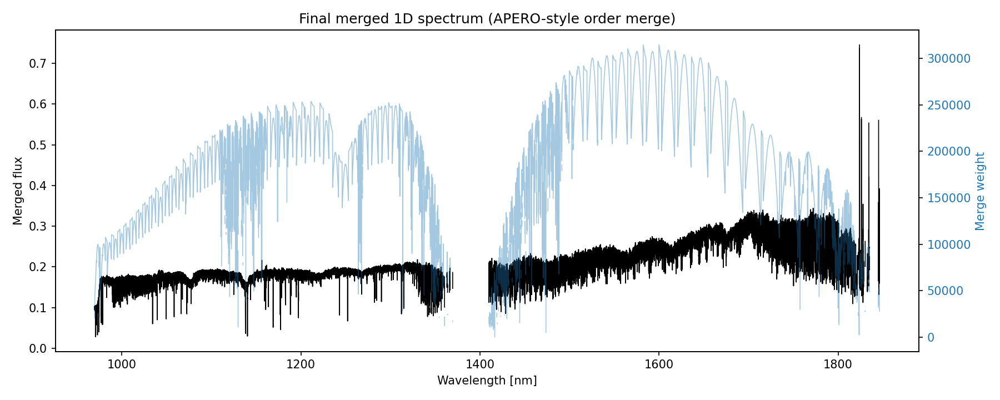
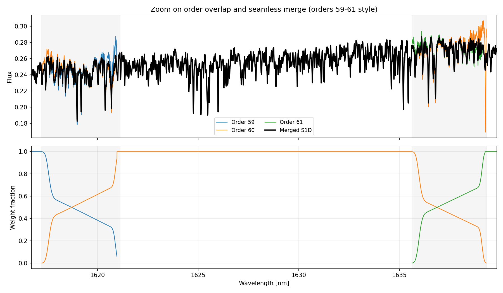

# S1Drama

APERO-style conversion from 2D extracted echelle orders (s2d/e2ds-like FITS) to a merged 1D spectrum (s1d-like FITS table).

## Why this exists

Many analyses need a single 1D spectrum, but reduced echelle products are naturally 2D (order, pixel). S1D-Rama provides a transparent, script-level implementation of the APERO order-merging logic used to build 1D spectra.

The merging recipe follows APERO's approach where overlapping orders are combined using blaze-based weighting and edge tapering to avoid discontinuities.

## Scientific and software references

Core paper:
- Cook et al. (2022), PASP, APERO description, section 7.6 and figure 21.
- ADS link: https://ui.adsabs.harvard.edu/abs/2022PASP..134k4509C/abstract

APERO code path mirrored here:
- apero/science/extract/gen_ext.py
- Function: e2ds_to_s1d

APERO constants mirrored here (NIRPS defaults):
- apero/instruments/nirps_ha/constants.py
- apero/instruments/nirps_he/constants.py

## What this script does

Input:
- An s2d FITS file (t.fits) from which S1D-Rama extracts:
  - 2D flux image per order
  - 2D wavelength map per order
  - 2D blaze function per order

Output:
- FITS binary table extension named S1D with columns:
  - wavelength [nm] — observed-frame wavelength
  - wavelength_zerovel [nm] — rest-frame wavelength (corrected for BERV + systemic velocity)
  - flux
  - eflux
  - weight

Algorithm outline (APERO-style):
1. Build target 1D wavelength grid (uniform in velocity).
2. Build edge taper weights per order so order ends fade in/out smoothly.
3. Multiply flux/blaze by edge taper.
4. Spline each order onto the target 1D grid.
5. Combine overlapping orders using blaze as weight.
6. Normalize by total weight in each bin.
7. Write merged vectors to FITS.

### Velocity correction

S1D-Rama automatically reads the barycentric Earth radial velocity (BERV) and target systemic velocity from the FITS header and computes a rest-frame wavelength grid:

- BERV is read from extension 1 header keyword `BERV` (km/s)
- Systemic velocity is read from extension 0 header keyword `ESO TEL TARG RADVEL` (km/s)
- The relativistic Doppler correction is applied: λ_rest = λ_obs × √[(1 - β)/(1 + β)] where β = v_total/c
- Both `wavelength` (observed) and `wavelength_zerovel` (rest-frame) columns are written to the output

This allows direct template matching and cross-correlation in the stellar rest frame without additional velocity shifts.

## Quick start (grad-student-proof)

### 1. Clone and enter the repo

```bash
git clone https://github.com/eartigau/s1drama
cd s1drama
```

If you already have the repo and want updates:

```bash
git pull --ff-only
```

### 2. Create a Python environment

Option A (venv):

```bash
python3 -m venv .venv
source .venv/bin/activate
python -m pip install --upgrade pip
python -m pip install -r requirements.txt
```

Option B (conda):

```bash
conda create -n s1drama python=3.12 -y
conda activate s1drama
python -m pip install --upgrade pip
python -m pip install -r requirements.txt
```

### 3. Run on your FITS file

```bash
python mk1d.py --make-plots data/NIRPS.2023-08-29T01:33:35.188t.fits
```

You can also process many files with wildcards:

```bash
python mk1d.py "data/*.fits"
```

Tip: quoting the wildcard ensures Python receives the pattern directly.

Default behavior in batch mode:
- output files are written in the YAML-defined folder `io.output_dir`
- files already processed are skipped automatically
- files that already look like merged outputs (suffix `io.output_suffix`) are skipped

To force reprocessing (overwrite existing outputs):

```bash
python mk1d.py --force "data/*.fits"
```

Expected products:
- products/s1d/NIRPS.2023-08-29T01:33:35.188t_s1d_apero.fits
- docs/figures/NIRPS.2023-08-29T01:33:35.188t_fig1_e2ds.png
- docs/figures/NIRPS.2023-08-29T01:33:35.188t_fig2_edge_taper.png
- docs/figures/NIRPS.2023-08-29T01:33:35.188t_fig3_s1d.png
- docs/figures/NIRPS.2023-08-29T01:33:35.188t_fig4_overlap_zoom.png

### 4. Inspect output quickly

```bash
python - <<'PY'
from astropy.io import fits
p='products/s1d/NIRPS.2023-08-29T01:33:35.188t_s1d_apero.fits'
with fits.open(p) as h:
    print('HDUS', len(h))
    print('EXT1', h[1].name)
    print('COLS', h[1].columns.names)
    print('NROWS', len(h[1].data))
PY
```

## Configuration (all tunables in YAML)

Configuration file:
- config/s1drama.yaml

This file controls:
- FITS extension names (flux/wave/blaze)
- output directory and output filename suffix
- Merge constants (wavelength limits, binning, blaze threshold, edge smoothing)
- Plot defaults

You can provide another config file at runtime:

```bash
python mk1d.py --config config/s1drama.yaml data/your_file.fits
```

CLI flags override YAML values.

## Figures

### Figure 1: Input 2D orders (flux)



### Figure 2: Example order-edge taper



### Figure 3: Final merged 1D spectrum and merge weight



### Figure 4: Zoom on overlap between orders 59-61

Color-coded order spectra are shown together with the merged S1D. The lower panel
shows each order's weight fraction, making the transition at order boundaries
explicit and demonstrating the seamless handoff in overlap regions.



## Notes on fidelity versus full APERO pipeline

S1D-Rama reproduces the merge logic from APERO's e2ds_to_s1d function.

It is intentionally a standalone implementation and does not run the full APERO reduction chain (calibrations, extraction, telluric recipes, database interactions, etc.).

## Command reference

```bash
python mk1d.py --help
```

Useful options:
- --make-plots: generate documentation/debug figures
- --fig-dir: choose where figures are written
- --output-dir: override YAML output directory
- --force: overwrite already processed outputs
- --output: custom single-file output path (single input only)

## License and attribution

Please cite APERO (Cook et al. 2022) when this method is used in scientific work.
